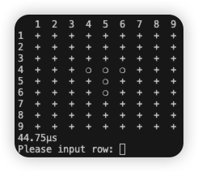

# 控制台版五子棋Golang版練習

透過玩家手動輸入Row and Column來指定擺放棋子的位置

```
// 用戶輸入邏輯控制
func InputVal(typeStr string, v *int, limit int) {
	// fmt.Scan(row)
	r := bufio.NewReader(os.Stdin)
	for {
		fmt.Printf("Please input %s: ", typeStr)
		t, _ := r.ReadString('\n')
		t = strings.TrimSpace(t)
		num, err := strconv.Atoi(t)
		if err != nil {
			fmt.Println("Please input correct type!!")
			fmt.Println("==============================")
			continue
		}

		if num < 1 || num >= limit {
			fmt.Printf("The range value is: %d~%d\n", 1, limit-1)
			fmt.Println("==============================")
			continue
		}

		*v = num
		return
	}
}
```

主要判斷是否獲勝的函示為IsWin，透過玩家擺放的位置，計算四個方向的線(上下，左右，左上右下，左下右上)
只要有一個方向的棋子 >= 5 即獲勝

```
// 檢查五連線邏輯，針對四條線來檢查是否形成五連線(上下，左右，左上右下，左下右上)
func IsWin(plate [][]int, player int, posX int, posY int) bool {
	// 上下
	connectCnt := 0
	minX := math.Max(1, float64(posX-5))
	maxX := math.Min(PLATE_COL-1, float64(posX+5))
	for x := minX; x <= maxX; x++ {
		if plate[int(x)][posY] == player {
			connectCnt++
		}
		if connectCnt >= 5 {
			return true
		}
	}

	// 左右
	connectCnt = 0
	minY := math.Max(1, float64(posY-5))
	maxY := math.Min(PLATE_ROW-1, float64(posY+5))
	for y := minY; y <= maxY; y++ {
		if plate[posX][int(y)] == player {
			connectCnt++
		}
		if connectCnt >= 5 {
			return true
		}
	}

	connectCnt = 1
	for i := 1; i <= 5; i++ {
		// 左上
		if posX-i > 0 && posY-i > 0 && plate[posX-i][posY-i] == player {
			connectCnt++
		}

		// 右下
		if posX+i < PLATE_COL && posY+i < PLATE_ROW && plate[posX+i][posY+i] == player {
			connectCnt++
		}
	}
	if connectCnt >= 5 {
		return true
	}

	connectCnt = 1
	for i := 1; i <= 5; i++ {
		// 左下
		if posX+i < PLATE_COL && posY-i > 0 && plate[posX+i][posY-i] == player {
			connectCnt++
		}

		// 右上
		if posX-i > 0 && posY+i < PLATE_ROW && plate[posX-i][posY+i] == player {
			connectCnt++
		}
	}
	return connectCnt >= 5
}
```



## TO DO
- BOT尚未完成
- 可以考慮整合為struct

<br /><br />

## 參考
1. https://www.youtube.com/watch?v=_Cc-dMVD2vs
